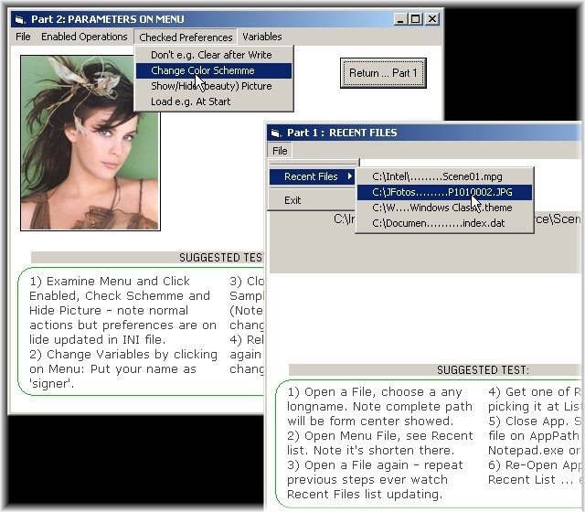



## Jz PrePar 1\.0

### Description

A module.bas, a few code lines: that's all you need to add Recent Files, Parameters and/or User Preferences features to your App.

All auto stored in a INI file. Easy for Admins, Easy for Users. Fully doccumented code.
 
### More Info
 

             |
---                |---
**Submitted On**   |2007-01-20 10:53:14
**By**             |[JOZE Walter Moura](https://github.com/Planet-Source-Code/PSCIndex/blob/master/ByAuthor/joze-walter-moura.md)
**Level**          |Intermediate
**User Rating**    |5.0 (10 globes from 2 users)
**Compatibility**  |VB 6\.0
**Category**       |[Coding Standards](https://github.com/Planet-Source-Code/PSCIndex/blob/master/ByCategory/coding-standards__1-43.md)
**World**          |[Visual Basic](https://github.com/Planet-Source-Code/PSCIndex/blob/master/ByWorld/visual-basic.md)
**Archive File**   |[Jz\_PrePar\_2043631202007\.zip](https://github.com/Planet-Source-Code/joze-walter-moura-jz-prepar-1-0__1-67687/archive/master.zip)

